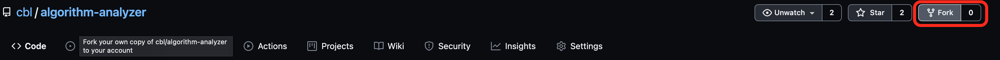
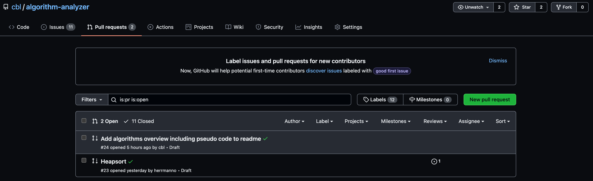
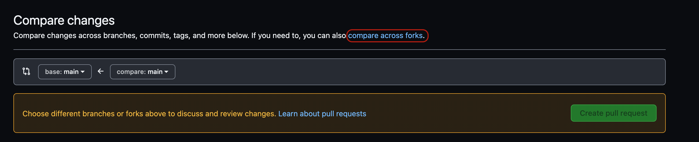
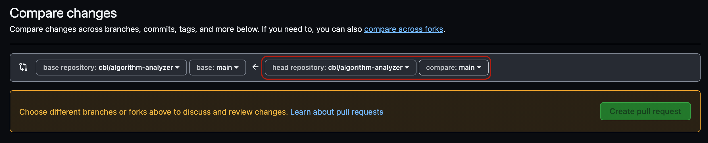

# Contribution Guideline

## Introduction

The algorithm-analyzer project is intended as a joint project of the class 20INB at the HTWK Leipzig. Everyone is welcome to contribute implementations or improvements.

If you want to contribute an implementation, select an algorithm from the [Issues](https://github.com/cbl/algorithm-analyzer/issues) section. Please share when you are working on an implementation so that work is not done multiple times. You can either create an empty pull request and mark it as draft or leave a comment in the corresponding issue.

## How To Submit A Pull Request

To contribute an implementation of an algorithm, you must create a pull request from a fork (a copy of the project). The following explains how this works. Alternative you can also read [this guide](https://jarv.is/notes/how-to-pull-request-fork-github/) by [Jake Jarvis](https://jarv.is/).

1. Forking the repository:

Create a copy of the repository by clicking on the `Fork` button on the top right:



2. Clone your fork locally:

You can clone the fork using the following command using your github username:

```shell
git clone https://github.com/your-github-username/algorithm-analyzer.git
```

3. Create a branch:

Create a branch named after the implementation you want to contribute (e.g.: bubblesort):

```shell
cd algorithm-analyzer
git checkout -b bubblesort
```

4. Write your code.

5. Commit and push your code:

You can push the code to your repository by adding the files you have edited, commiting them with a descriptive message and pushing the afterwards:

```shell
git add .
git commit -m "added bubblesort"
git push
```

6. Submit your pull request:

You can submit a pull request by visiting the original repository [cbl/algorithm-analyzer](https://github.com/cbl/algorithm-analyzer/pulls) and clicking on **New Pull Request**.



Then click on **compare across forks**:



Now you can select your branch that includes the implementation, for our example this would be `bubblesort`:



Finally you need to add a describtive title and a description of the implementation you want to contribute.
